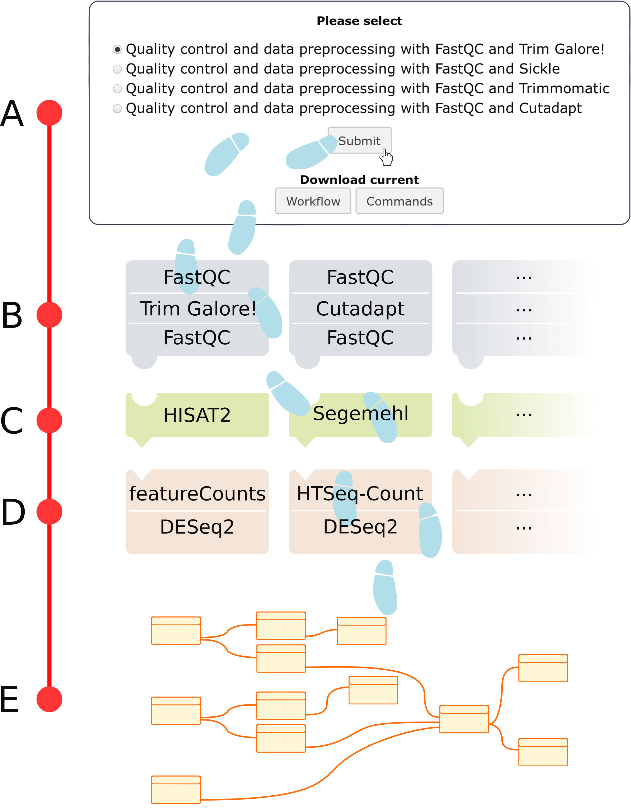

[](https://travis-ci.org/destairdenbi/galaxy-modular-workflow-generator)
[](https://quay.io/repository/destair/galaxy-workflow-generator)

Galaxy workflow generator for assisted RNA-Seq and BS-Seq data analyses
=======================================================================

The Galaxy workflow generator is a self-contained Galaxy instance, comprising a set of analysis tools and related guided tours.  
Guided tours are usually associated with consolidated workflows, composed of multiple tools, each of which is explained in terms of its function and parametrization options. However, such structure presents an analysis as monolithic: tools are pre-selected, and executed in cascade until the result is retrieved. With this unbreakable flow, users cannot readily appreciate the existence of alternative routes (tools) to compose their workflow analyses. At the same time, trainers willing to include such information within the designated training material, would have to continuously update every workflow mentioning each alternative tool.  
To overcome these limitations, in the Galaxy workflow generator we provide guided tours that focus on tools rather than workflows, therefore enabling users to perform a specific analysis not by strictly following a pre-defined path, but by walking one.

- [Usage](#usage)
  - [Requirements](#requirements)
  - [Launch](#launch)
  - [Login credentials](#login-credentials)
  - [How it works](#how-it-works)
- [Available tools](#available-tools)
  - [Quality control](#quality-control)
  - [Read mapping](#read-mapping)
  - [Differential gene expression analysis](#differential-gene-expression-analysis)
  - [Utilities](#utilities)
- [Support and bug reports](#support-and-bug-reports)
- [Contributing](#contributing)
- [Contributors](#contributors)
- [MIT license](#mit-license)

# Usage
This Galaxy instance is provided as a Docker container, developed from [Docker Galaxy Stable](https://github.com/bgruening/docker-galaxy-stable). Whether you are a user, a developer, or an administrator, you only need to have [Docker](https://www.docker.com/) set up to run the container. Here we illustrate how to do so.
<p align="right"><a href="#top">&#x25B2; back to top</a></p>

## Requirements

The only requirement is [Docker](https://www.docker.com/), which can be installed in different ways depending on your system:
- Unix users should follow the [Docker installation for Linux](https://docs.docker.com/installation)
- MacOS 10.12+ users should follow the [Docker installation for Mac](https://hub.docker.com/editions/community/docker-ce-desktop-mac)
- Windows 10+ users, should follow the [Docker installation for Windows](https://hub.docker.com/editions/community/docker-ce-desktop-windows)
- Non-unix users whose operative system version is older than the aforementioned one, can rely on [Kitematic](https://kitematic.com/)

<p align="right"><a href="#top">&#x25B2; back to top</a></p>

## Launch

The Galaxy Docker container can be launched in different ways.

### Without Kitematic

Users not relying on Kitematic can open a terminal, or a Windows PowerShell if on Windows, and type:

```
$ docker run --rm --net bridge -d -p 8080:80 --name destair --hostname destair quay.io/destair/galaxy-workflow-generator:latest
```

An additional paramters will allow a subset of tools to use multiple threads

```
$ docker run -e "GALAXY_CONFIG_PARALLEL_SLURM_PARAMS=--ntasks=8" -e "GALAXY_CONFIG_PARALLEL_LOCAL_NTASKS=8" ...
```

After that, the Galaxy instance can be accessed in a web browser at:

```
localhost:8080
```

We recommend using Google Chrome, Chromium, or Mozilla Firefox.

### With Kitematic

Kitematic users can instead launch the Galaxy instance by following [these instructions](https://docs.docker.com/kitematic/userguide/).

<p align="right"><a href="#top">&#x25B2; back to top</a></p>


## Login credentials

To be able to use the Galaxy workflow generator, a user nees to be logged in. 

- If you don't have one, please create it using the link provided at the top right corner
- If you have one, please enter your credentials in the form at the top right corner
- Galaxy administrators can instead use the default credentials username: `admin`, password: `admin`, and then change the settings later on

<p align="right"><a href="#top">&#x25B2; back to top</a></p>

## How it works

Here we show how the workflow generation takes place, and how users build their analyses.  
The following scenario illustrates a differential gene expression analysis, whose best-practice steps are:
- Data preprocessing and quality control
- Mapping
- Counting

<p align="center">

</p>

**A**) An [interactive dialog](https://docs.galaxyproject.org/en/latest/admin/webhooks.html) asks the user how they intend to carry out data preprocessing and quality control. When a choice is selected, Galaxy launches the relative interactive tour to guide the user through tools, parametrisation, and the meaning of results.  

**B**) Selected tools have alternative counterparts. For instance, Trim Galore! can be replaced by another sequence trimming tool. As a best-practice however, each trimming tool is execute before and after FastQC. At this point, a user wil run both FASTQC and Trim Galore! tours, and understand their functions, parametrisations, and outputs.  

**C**) As the Data preprocessing phase ends, users are presented with another interactive dialog, asking which Mapping tool to use.  

**D**) When the mapping phase ends, the counting phase starts. Once again, the workflow generator presents a set of best-practice tools, and users are requested to selected their tools of choice to complete the analysis.

**E**) Finally, the workflows can be exported, and run on a different Galaxy instances.

Before the workflow generation, *best practice workflows* were crafted from beginning to end, without presenting its users any alternative to carry out their analyses. With the present approach however, we break down a workflow in its phases, and show users alternative *best-practice tools* to build their workflows. This way,
- Users can discover newly developed alternatives, and self train on a wider range of state-of-the-art tools;
- Trainers can create flexible workflows to thread alternative best-practice tools into a single workflow.

<p align="right"><a href="#top">&#x25B2; back to top</a></p>

# Available tools

## Quality control

Tool | Description | Reference
--- | --- | ---
[Cutadapt](https://cutadapt.readthedocs.io/en/stable) | Error-tolerant adapter removal tool for High-Throughput Sequencing reads | [Martin 2011](https://doi.org/10.14806/ej.17.1.200)
[FastQC](https://www.bioinformatics.babraham.ac.uk/projects/fastqc/) | A quality control tool for high throughput sequence data |
[Sickle](https://github.com/najoshi/sickle) | Windowed adaptive trimming tool for FASTQ files | Joshi et al. 2011
[Trim Galore!](https://www.bioinformatics.babraham.ac.uk/projects/trim_galore/) | Quality control tool for read trimming and filtering of NGS data |
[Trimmomatic](https://www.usadellab.org/cms/?page=trimmomatic) | Quality control tool for read trimming and filtering of Illumina NGS data | [Bolger et al. 2014](https://doi.org/10.1093/bioinformatics/btu170)

<p align="right"><a href="#top">&#x25B2; back to top</a></p>

## Read mapping

Tool | Description | Reference
--- | --- | ---
[BWA](https://bio-bwa.sourceforge.net/) | Burrows-Wheeler Aligner for mapping low-divergent sequences against a large reference genome | [Li and Durbin 2010](https://doi.org/10.1093/bioinformatics/btp698)
[HISAT2](https://ccb.jhu.edu/software/hisat2/) | Hierarchical indexing for spliced alignment of transcripts | [Pertea et al. 2016](https://doi.org/10.1038/nprot.2016.095)
[Segemehl](https://www.bioinf.uni-leipzig.de/Software/segemehl/) | Short sequence read to reference genome mapper | [Otto et al. 2014](https://doi.org/10.1093/bioinformatics/btu146)
[STAR](https://github.com/alexdobin/STAR) | Rapid spliced aligner for RNA-seq data | [Dobin et al. 2013](https://doi.org/10.1093/bioinformatics/bts635)

<p align="right"><a href="#top">&#x25B2; back to top</a></p>


## Differential gene expression analysis

Tool | Description | Reference
--- | --- | ---
[DESeq2](https://bioconductor.org/packages/release/bioc/html/DESeq2.html) | Differential gene expression analysis based on the negative binomial distribution | [Love et al. 2014](https://doi.org/10.1186/s13059-014-0550-8)
[featureCounts](http://bioinf.wehi.edu.au/featureCounts/) | Genomic feature read count tool for summarising of genes, exons, and promoter counts | [Liao et al. 2014](https://doi.org/10.1093/bioinformatics/btt656)
[htseq-count](https://www-huber.embl.de/HTSeq/doc/count.html) | Tool for counting reads in features | [Anders et al. 2015](https://doi.org/10.1093%2Fbioinformatics%2Fbtu638)
[RSeQC](http://rseqc.sourceforge.net) | An RNA-seq Quality Control Package | [Wang et al. 2012](https://doi.org/10.1093/bioinformatics/bts356)

<p align="right"><a href="#top">&#x25B2; back to top</a></p>

## Bisulfite sequencing data analysi
sTool | Description | Reference
--- | --- | ---
[Bismark](https://www.bioinformatics.babraham.ac.uk/projects/bismark) | Bismark is a program to map bisulfite treated sequencing reads to a genome of interest and perform methylation calls | [Krueger et al. 2011](https://doi.org/10.1093/bioinformatics/btr167)
[MethylDackel](https://github.com/dpryan79/MethylDackel) | A tool extract per-base methylation metrics from coordinate-sorted and indexed BS-seq alignments | [Devon Ryan](https://github.com/dpryan79/MethylDackel)

## Utilities

Tool | Description | Reference
--- | --- | ---
[SAMtools](https://samtools.sourceforge.net/) | Utilities for manipulating alignments in the SAM format | [Heng et al. 2009](https://doi.org/10.1093/bioinformatics/btp352)
[BLAST+](ftp://ftp.ncbi.nlm.nih.gov/blast/executables/blast+/LATEST) | A software library of tools for sequence similarity search | [Camacho et al. 2009](https://doi.org/10.1186/1471-2105-10-421)
[SortMeRNA](https://bioinfo.lifl.fr/RNA/sortmerna/) | A tool for filtering, mapping and OTU-picking NGS reads in metatranscriptomic and -genomic data | [Kopylova et al. 2011](https://doi.org/10.1093/bioinformatics/bts611)
[Rcorrector](https://github.com/mourisl/Rcorrector) | Rcorrector is a kmer-based error correction method for RNA-seq data | [Song et al. 2015](https://doi.org/10.1186/s13742-015-0089-y)

<p align="right"><a href="#top">&#x25B2; back to top</a></p>

# Support and bug reports

If you have questions, or don't know how to solve a problem using the provided Galaxy instance, please contact us [here](https://destair.bioinf.uni-leipzig.de/about/), or file an [issue](https://github.com/destairdenbi/galaxy-workflow-generator/issues).

<p align="right"><a href="#top">&#x25B2; back to top</a></p>

# Contributing

New contributions are always welcome. Please read [these instructions](
https://github.com/destairdenbi/galaxy-workflow-generator/blob/master/CONTRIBUTING.md) before proceeding in doing so.

<p align="right"><a href="#top">&#x25B2; back to top</a></p>

# Contributors

 - [Andrea Bagnacani](https://github.com/bagnacan)
 - [Bérénice Batut](https://github.com/bebatut)
 - [Björn Grüning](https://github.com/bgruening)
 - [Steffen Lott](https://github.com/lotts)
 - [Konstantin Riege](https://github.com/koriege)
 - [Markus Wolfien](https://github.com/mwolfien)

<p align="right"><a href="#top">&#x25B2; back to top</a></p>

# MIT license

Permission is hereby granted, free of charge, to any person obtaining a copy
of this software and associated documentation files (the "Software"), to deal
in the Software without restriction, including without limitation the rights
to use, copy, modify, merge, publish, distribute, sublicense, and/or sell
copies of the Software, and to permit persons to whom the Software is
furnished to do so, subject to the following conditions:

The above copyright notice and this permission notice shall be included in
all copies or substantial portions of the Software.

THE SOFTWARE IS PROVIDED "AS IS", WITHOUT WARRANTY OF ANY KIND, EXPRESS OR
IMPLIED, INCLUDING BUT NOT LIMITED TO THE WARRANTIES OF MERCHANTABILITY,
FITNESS FOR A PARTICULAR PURPOSE AND NONINFRINGEMENT. IN NO EVENT SHALL THE
AUTHORS OR COPYRIGHT HOLDERS BE LIABLE FOR ANY CLAIM, DAMAGES OR OTHER
LIABILITY, WHETHER IN AN ACTION OF CONTRACT, TORT OR OTHERWISE, ARISING FROM,
OUT OF OR IN CONNECTION WITH THE SOFTWARE OR THE USE OR OTHER DEALINGS IN
THE SOFTWARE.

<p align="right"><a href="#top">&#x25B2; back to top</a></p>
